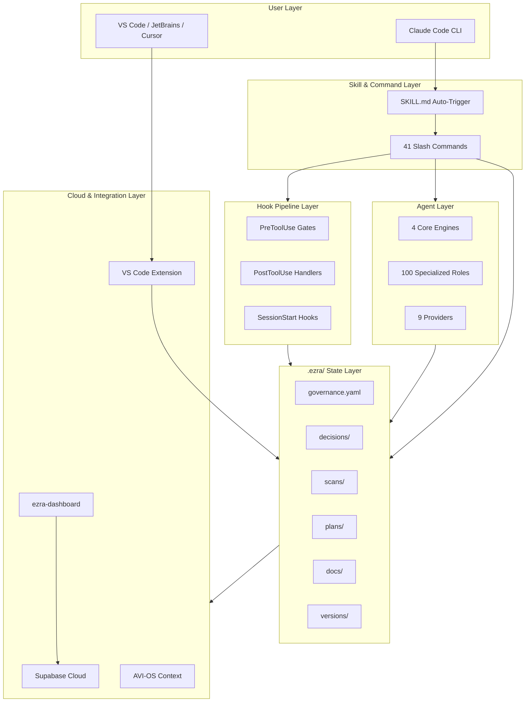
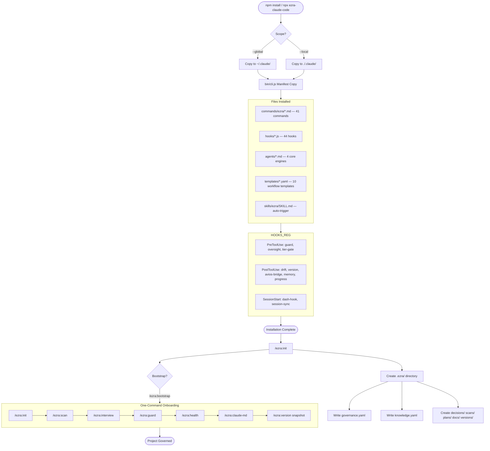
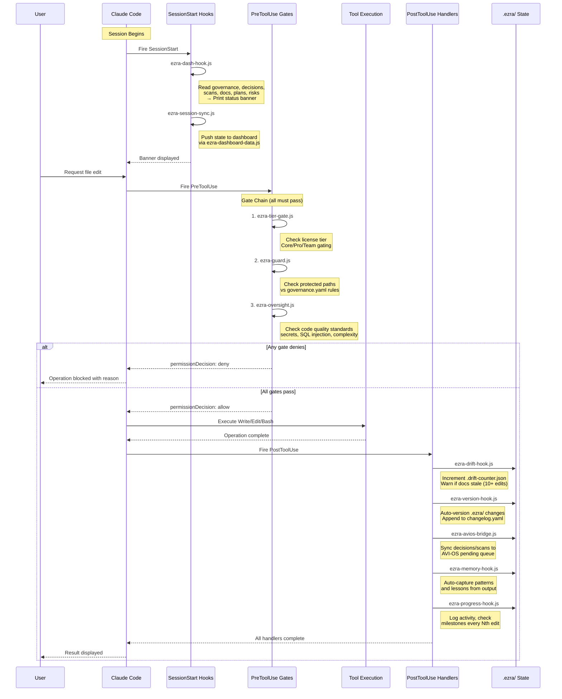
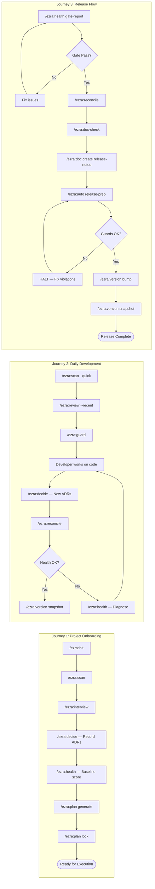
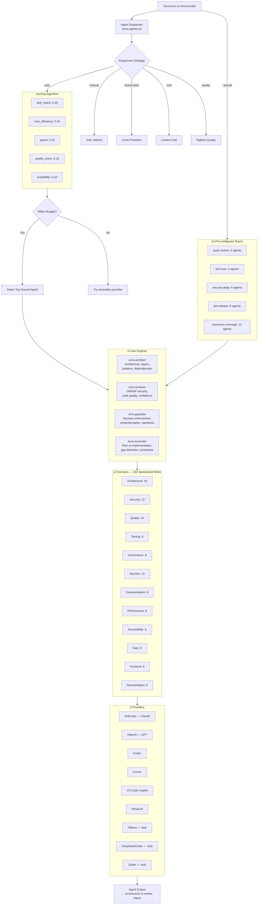
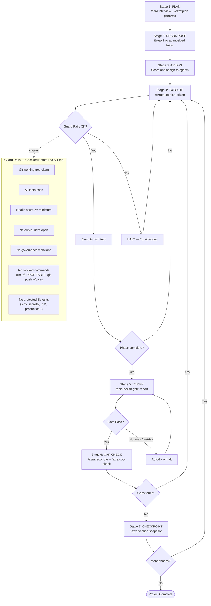
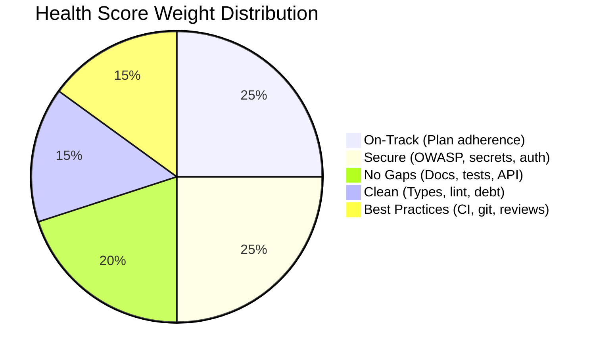

# EZRA System Workflow — Complete Architecture Diagrams

This document maps every layer of the EZRA (v6.1.0) governance framework, from installation through session lifecycle, hook pipeline, command workflows, agent orchestration, state management, and external integrations.

---

## 1. System Architecture Overview

High-level view of EZRA's 5-layer architecture and how components connect.

---

## 2. Installation & Bootstrap Flow

How EZRA gets installed and a project gets onboarded.

---

## 3. Session Lifecycle & Hook Pipeline

What happens from the moment a Claude Code session starts through every tool operation.

---

## 4. Command Workflow — User Journeys

Three primary user journeys showing command sequences, decision points, and phase gates.

---

## 5. Agent Orchestration & Dispatch

How EZRA selects, scores, and dispatches agents across providers.

---

## 6. State Management & Data Flow

What lives in `.ezra/` and which components read/write each file.

```mermaid
flowchart LR
    subgraph EZRA_DIR[".ezra/ State Directory"]
        direction TB
        GOV["governance.yaml<br/>Rules, protected paths,<br/>standards, enforcement"]
        KNOW["knowledge.yaml<br/>Architecture, patterns,<br/>layers, dependencies"]
        SETTINGS["settings.yaml<br/>Config, providers,<br/>budgets, integrations"]

        subgraph DEC["decisions/"]
            ADR["ADR-001.yaml<br/>ADR-002.yaml<br/>..."]
        end

        subgraph SCANS_DIR["scans/"]
            SCAN_F["timestamp.yaml<br/>Health score,<br/>findings"]
        end

        subgraph PLANS_DIR["plans/"]
            PLAN_F["master-plan.yaml<br/>phases.yaml<br/>tasks.yaml"]
        end

        subgraph DOCS_DIR["docs/"]
            REG["registry.yaml<br/>81 document types"]
            DRIFT[".drift-counter.json<br/>Edit counts per doc"]
        end

        subgraph VER_DIR["versions/"]
            CUR["current.yaml<br/>Version, timestamp"]
            LOG_F["changelog.yaml<br/>Append-only audit trail"]
            SNAP["snapshots/<br/>Named checkpoints"]
        end

        subgraph OVER_DIR["oversight/"]
            VIOL["violations.log<br/>Rotates at 1MB"]
        end

        subgraph PROG_DIR["progress/"]
            ACT["activity.log<br/>Timestamp, tool, file"]
            MILE["milestones.yaml"]
        end

        subgraph AVIOS_DIR[".avios-sync/"]
            PEND["pending/*.json<br/>Sync instructions"]
        end
    end

    subgraph WRITERS["Writers"]
        W_INIT["/ezra:init"]
        W_SCAN["/ezra:scan"]
        W_DECIDE["/ezra:decide"]
        W_DOC["/ezra:doc"]
        W_PLAN["/ezra:plan"]
        W_GUARD["guard hook"]
        W_DRIFT["drift hook"]
        W_VER["version hook"]
        W_OVER["oversight hook"]
        W_PROG["progress hook"]
        W_AVIOS["avios-bridge hook"]
    end

    subgraph READERS["Readers"]
        R_GUARD["guard hook"]
        R_DASH["dash hook"]
        R_HEALTH["/ezra:health"]
        R_RECON["/ezra:reconcile"]
        R_SYNC["cloud-sync"]
    end

    W_INIT --> GOV
    W_INIT --> KNOW
    W_SCAN --> SCAN_F
    W_DECIDE --> ADR
    W_DOC --> REG
    W_PLAN --> PLAN_F
    W_DRIFT --> DRIFT
    W_VER --> CUR
    W_VER --> LOG_F
    W_OVER --> VIOL
    W_PROG --> ACT
    W_PROG --> MILE
    W_AVIOS --> PEND

    R_GUARD --> GOV
    R_GUARD --> ADR
    R_DASH --> GOV
    R_DASH --> ADR
    R_DASH --> SCAN_F
    R_DASH --> REG
    R_DASH --> PLAN_F
    R_HEALTH --> SCAN_F
    R_HEALTH --> ADR
    R_HEALTH --> REG
    R_RECON --> PLAN_F
    R_RECON --> SCAN_F
    R_SYNC --> GOV
    R_SYNC --> ADR
    R_SYNC --> SETTINGS
```

---

## 7. Integration Map

How EZRA Core connects to external systems: dashboard, IDE extensions, cloud, and AVI-OS.

```mermaid
flowchart TD
    subgraph CORE["EZRA Core (ezra-claude-code)"]
        HOOKS["44 Hooks"]
        CMDS["41 Commands"]
        AGENTS["4 Engines + 100 Roles"]
        STATE[".ezra/ State"]
    end

    subgraph CLAUDE_CODE["Claude Code Runtime"]
        SKILL_TRIGGER["SKILL.md Auto-Trigger"]
        HOOK_PROTO["Hook Protocol<br/>stdin JSON → stdout JSON"]
        SETTINGS_JSON["settings.json<br/>Hook registration"]
    end

    subgraph SUPABASE["Supabase Cloud"]
        SYNC_PUSH["/functions/v1/sync-push"]
        SYNC_PULL["/functions/v1/sync-pull"]
        LICENSE_API["/functions/v1/validate-license"]
        STRIPE["/functions/v1/stripe-webhook"]
        DB["8 Tables + RLS"]
    end

    subgraph DASHBOARD["ezra-dashboard (Next.js)"]
        LANDING["Landing Page"]
        DASH_UI["Dashboard Widgets"]
        PROJECTS["Projects View"]
        PRICING["Pricing + Stripe"]
        AUTH["Supabase Auth"]
    end

    subgraph VSCODE_EXT["ezra-vscode (VS Code Extension)"]
        STATUS_BAR["Status Bar — Health, Oversight, Cost"]
        SIDEBAR["5 Tree Views"]
        WEBVIEW["Settings + Dashboard WebViews"]
        VS_CMDS["9 Extension Commands"]
    end

    subgraph JETBRAINS["JetBrains Plugin"]
        JB_TOOL["JCEF Dashboard Tool Window"]
        JB_STATUS["Status Bar Widget"]
        JB_WATCH["File Watcher"]
    end

    subgraph AVIOS["AVI-OS Context (MCP Server)"]
        DECISIONS_MCP["Decision Records"]
        RISKS_MCP["Risk Register"]
        PROJECTS_MCP["Project State"]
    end

    %% Claude Code connections
    SKILL_TRIGGER -->|auto-trigger on session| CMDS
    HOOK_PROTO -->|stdin/stdout JSON| HOOKS
    SETTINGS_JSON -->|registers| HOOKS

    %% Cloud sync
    STATE -->|ezra-cloud-sync.js| SYNC_PUSH
    SYNC_PULL -->|pull changes| STATE
    STATE -->|ezra-license.js| LICENSE_API

    %% Dashboard
    STATE -->|ezra-dashboard-data.js| DASH_UI
    DASHBOARD --> AUTH
    AUTH --> DB
    DASH_UI --> DB
    PRICING --> STRIPE

    %% VS Code Extension
    VSCODE_EXT -->|reads .ezra/ state| STATE
    VS_CMDS -->|terminal commands| CMDS

    %% JetBrains
    JETBRAINS -->|reads .ezra/ state| STATE
    JB_WATCH -->|file change events| STATE

    %% AVI-OS
    STATE -->|ezra-avios-bridge.js<br/>pending queue| AVIOS
    CMDS -->|/ezra:sync| AVIOS
```

---

## 7-Stage Execution Pipeline

The complete end-to-end pipeline for plan-driven autonomous execution.

---

## Health Scoring — 5 Pillars

| Grade | Score | Meaning |
|-------|-------|---------|
| **A** | 90-100 | Release ready |
| **B** | 75-89 | Minor issues |
| **C** | 60-74 | Needs attention |
| **D** | 40-59 | Major blockers |
| **F** | 0-39 | Cannot proceed |

---

## Quick Reference: All 41 Commands by Category

| Category | Commands |
|----------|----------|
| **Setup** | init, bootstrap, install, claude-md |
| **Analysis** | scan, review, health, advisor |
| **Governance** | guard, decide, oversight, compliance |
| **Documents** | doc, doc-check, doc-sync, doc-approve |
| **Planning** | plan, interview, assess, pm, progress |
| **Execution** | process, auto, workflow |
| **Visibility** | status, dash, portfolio |
| **Versioning** | version, reconcile |
| **Knowledge** | memory, learn, handoff, library |
| **Integration** | sync, agents, multi |
| **System** | settings, cost, research, license, help |

## Quick Reference: All 44 Hooks

| Hook | Event | Purpose |
|------|-------|---------|
| ezra-guard.js | PreToolUse | Protected path enforcement |
| ezra-oversight.js | PreToolUse | Code quality and security checks |
| ezra-tier-gate.js | PreToolUse | License tier feature gating |
| ezra-dash-hook.js | SessionStart | Project status banner |
| ezra-session-sync.js | SessionStart | Dashboard state push |
| ezra-drift-hook.js | PostToolUse | Document drift detection |
| ezra-version-hook.js | PostToolUse | Auto-versioning of .ezra/ state |
| ezra-avios-bridge.js | PostToolUse | AVI-OS decision/risk sync |
| ezra-memory-hook.js | PostToolUse | Pattern and lesson capture |
| ezra-progress-hook.js | PostToolUse | Activity logging and milestone checks |
| ezra-settings.js | Utility | Settings parser (imported) |
| ezra-settings-writer.js | Utility | Settings write-back (imported) |
| ezra-agents.js | Utility | Multi-agent orchestration (imported) |
| ezra-library.js | Utility | Best practice library (imported) |
| ezra-cloud-sync.js | Utility | Cloud backup/restore (imported) |
| ezra-dashboard-data.js | Utility | Dashboard data aggregation (imported) |
| ezra-error-codes.js | Utility | Error code catalog (imported) |
| ezra-hook-logger.js | Utility | Structured JSON logger (imported) |
| ezra-http.js | Utility | HTTP client with SSRF protection (imported) |
| ezra-installer.js | Utility | CLI installer logic (imported) |
| ezra-license.js | Utility | License management (imported) |
| ezra-memory.js | Utility | Knowledge base engine (imported) |
| ezra-planner.js | Utility | Planning engine (imported) |
| ezra-pm.js | Utility | Project manager (imported) |
| ezra-workflows.js | Utility | Workflow template engine (imported) |
| ezra-commit-engine.js | Utility | Git commit batching and safety (imported) |
| + 18 more | Various | Phase gates, execution, notifier, scheduler, etc. |
